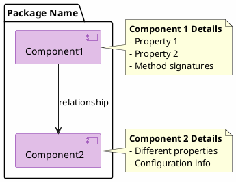
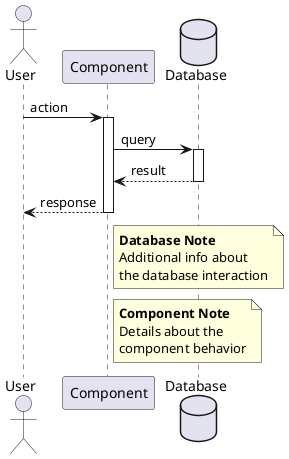
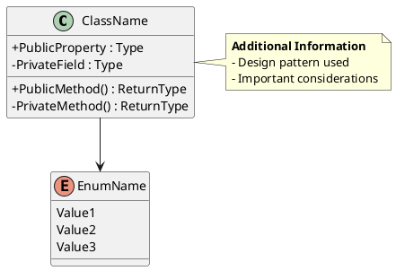

# PlantUML Syntax Strategies for Tseten Documentation

## Overview

This document provides specific strategies and patterns for writing valid PlantUML syntax that renders correctly. These guidelines emerged from fixing syntax errors in the Tseten PlantUML documentation.

## Common Syntax Errors and Solutions

### Error 1: Multi-line Component Blocks

**❌ INVALID Syntax:**
```plantuml
component "ComponentName" as alias {
    **Title**
    ====
    - Detail 1
    - Detail 2
    ----
    More info
}
```

**Problem:** PlantUML component diagrams don't support multi-line content inside braces `{ }`.

**✅ VALID Solution:**
```plantuml
component [ComponentName] as alias

note right of alias
    **Title**
    
    - Detail 1
    - Detail 2
    
    More info
end note
```

**Pattern:** Use simple bracket notation `[Name]` for the component, then add a separate note with positioning (`right of`, `left of`, `top of`, `bottom of`) to provide details.

### Error 2: Note Positioning in Sequence Diagrams

**❌ INVALID Syntax:**
```plantuml
database "Database" as db

note bottom of db
    Database information
end note
```

**Problem:** In sequence diagrams, `note [position] of [participant]` doesn't work reliably for database/box participants.

**✅ VALID Solution:**
```plantuml
database "Database" as db

note over db
    Database information
end note
```

**Pattern:** Use `note over [participant]` for sequence diagram participants instead of positional notes.

### Error 3: Skinparam Component vs Component Definition

**✅ VALID - Skinparam:**
```plantuml
skinparam component {
    BackgroundColor #E1BEE7
    BorderColor #7B1FA2
}
```

**✅ VALID - Component:**
```plantuml
component [MyComponent] as mycomp
```

**Pattern:** `component {` is only valid within `skinparam` blocks for styling. For actual components, use `component [Name]` or `component "Name"`.

## Diagram-Specific Strategies

### Component Diagrams

**Best Practice Structure:**


**Key Points:**
1. Use `[ComponentName]` bracket notation
2. Keep components simple - one line
3. All details go in separate notes
4. Position notes relative to components

### Sequence Diagrams

**Best Practice Structure:**


**Key Points:**
1. Use `note over [participant]` for general notes
2. Use `note right of`/`note left of` for side notes
3. Avoid `note bottom of`/`note top of` in sequence diagrams
4. Keep message text concise (< 200 chars with maxMessageSize)

### Class Diagrams

**Best Practice Structure:**


**Key Points:**
1. Class blocks with `{ }` ARE valid for class diagrams
2. Use `+` for public, `-` for private, `#` for protected
3. Separate properties from methods with `__`
4. Notes can be added outside class blocks

## Width Management (1200px Constraint)

### Strategy 1: Scale Directive
```plantuml
@startuml
scale 0.95

' diagram content
@enduml
```

**When to use:** When diagram is slightly over 1200px (up to 1300px).

### Strategy 2: Font Size Reduction
```plantuml
skinparam defaultFontSize 10
```

**When to use:** When you need a bit more space without changing proportions.

### Strategy 3: Wrap Width
```plantuml
skinparam wrapWidth 200
skinparam maxMessageSize 180
```

**When to use:** For diagrams with long text that can be wrapped.

### Strategy 4: Restructure
- Break large packages into smaller ones
- Use shorter alias names
- Simplify note content
- Split into multiple diagrams if necessary

**When to use:** When scaling doesn't help enough.

## Testing Syntax

### Command Line Validation
```bash
# Syntax check only (fast)
java -jar plantuml.jar -syntax diagram.puml

# Render to PNG (validates and creates image)
java -jar plantuml.jar -tpng diagram.puml

# Check for errors
java -jar plantuml.jar -tpng diagram.puml 2>&1 | grep -i error
```

### Iterative Testing Process
1. Make changes to .puml file
2. Run `java -jar plantuml.jar -tpng file.puml`
3. Check for error output
4. If errors, note the line number
5. Fix the specific line
6. Repeat until successful

## Common Error Messages

### "Error line X: Some diagram description contains errors"
- **Cause:** Invalid syntax on or near line X
- **Fix:** Check line X and surrounding lines for:
  - Unclosed blocks (missing `end note`, `}`, etc.)
  - Invalid component syntax with braces
  - Typos in keywords

### "Cannot run program '/opt/local/bin/dot'"
- **Cause:** Graphviz not installed or not in PATH
- **Fix:** `sudo apt-get install graphviz` (Linux) or ensure dot is in PATH

### Diagram renders but looks wrong
- **Cause:** Valid syntax but incorrect relationships or positioning
- **Fix:** Review PlantUML documentation for the specific diagram type

## Information Density Patterns

### Pattern 1: List in Notes
```plantuml
note right of component
    **Endpoints:**
    - GET /api/resource
    - POST /api/resource
    - PUT /api/resource
    - DELETE /api/resource/{id}
end note
```

### Pattern 2: Structured Information
```plantuml
note left of component
    **Configuration**
    
    Database: PostgreSQL
    Port: 5432
    Pooling: Enabled
    
    **Features**
    - Connection retry
    - Query caching
    - Transaction support
end note
```

### Pattern 3: Code Examples
```plantuml
note bottom of class
    **Example Usage:**
    
    var obj = new ClassName();
    obj.Method1();
    obj.Method2(param);
end note
```

## PlantUML Version Compatibility

**Recommended Version:** PlantUML 1.2024.7 or later

**Key Features Required:**
- Component diagrams with bracket notation
- `note over` in sequence diagrams
- Skinparam styling
- Package grouping

**Testing Matrix:**
- ✅ PlantUML 1.2024.7 + Graphviz 2.43.0
- ✅ PlantUML 1.2023.x + Graphviz 2.40+
- ⚠️ Older versions may have syntax limitations

## Checklist for Valid PlantUML

Before considering a diagram complete, verify:

- [ ] No multi-line content in component `{ }` blocks (component diagrams)
- [ ] All notes use valid positioning (`note over`, `note right of`, etc.)
- [ ] No `note bottom of` / `note top of` in sequence diagrams
- [ ] All blocks properly closed (`end note`, `}`, `@enduml`)
- [ ] Skinparam blocks are properly structured
- [ ] Component definitions use `[Name]` or simple string notation
- [ ] Width verified to be ≤ 1200px when rendered
- [ ] File renders without errors: `java -jar plantuml.jar -tpng file.puml`
- [ ] Generated PNG is valid: `file diagram.png` shows "PNG image data"

## Refactoring Workflow

When fixing invalid PlantUML:

1. **Identify Error:** Run PlantUML, note error line
2. **Classify Issue:** Match to one of the common errors above
3. **Apply Pattern:** Use the corresponding valid solution pattern
4. **Test:** Re-render to verify fix
5. **Verify Width:** Check PNG dimensions
6. **Commit:** If valid, commit the fix

## Examples from Tseten Project

### Example 1: Fixed Angular Architecture
**Before (Invalid):**
```plantuml
component "AuthService" as authService {
    **Authentication Service**
    ====
    - login(username, password)
    - logout()
}
```

**After (Valid):**
```plantuml
component [AuthService] as authService

note right of authService
    **Authentication Service**
    - login(username, password)
    - logout()
end note
```

### Example 2: Fixed Sequence Diagram Note
**Before (Invalid):**
```plantuml
database "Couchbase" as db

note bottom of db
    Database information
end note
```

**After (Valid):**
```plantuml
database "Couchbase" as db

note over db
    Database information
end note
```

## Additional Resources

- **Official PlantUML Site:** https://plantuml.com/
- **Component Diagram Guide:** https://plantuml.com/component-diagram
- **Sequence Diagram Guide:** https://plantuml.com/sequence-diagram
- **Class Diagram Guide:** https://plantuml.com/class-diagram
- **Skinparam Reference:** https://plantuml-documentation.readthedocs.io/en/latest/formatting/all-skin-params.html

## Version History

- **2026-01-10:** Initial version based on Tseten PlantUML fixes
- Documented common syntax errors and solutions
- Provided working patterns for all diagram types
- Established validation and testing procedures

